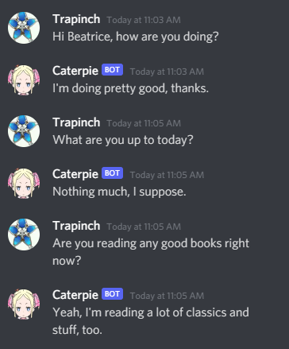
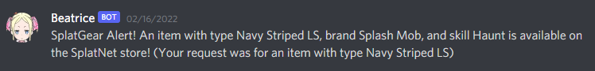

# Beatrice

All commands are prefixed with `-b ` so for example, the `chat` command is typed out as `-b chat`. 
Commands that do not rely on server-related features can usually also be called in a DM.

## Chat

Beatrice has a custom chatbot fine tuned from Microsoft's DialoGPT which is based on GPT2. 
It's computationally expensive, so it isn't enabled by default for servers, but you can 
ask the bot admin to enable it. Chat dynamically unloads the model if not used for five minutes so 
first responses after a while might take a bit longer to process.

The dataset for the model was created using subtitles from season one of Re:Zero as well as some custom conversational 
text written to instruct the model on certain aspects of the character. It was then trained on Google 
Colab using a notebook based on [this](https://github.com/RuolinZheng08/twewy-discord-chatbot).

The model for chat is a little weird and prone to dramatic freak-outs so don't be too alarmed. It seems 
the model interpreted her "tsundere" character into one that's actually just plain rude. 
It also tends to generate text that then gets her stuck in psychotic loops and struggles to hold contextualized 
or focused conversations. Needless to say, I'm not very good 
at machine learning-related things.

### Commands

- `chat`

Beatrice will create a public thread on your message where you can chat with her.

## SplatGear

SplatGear is a tool for receiving alerts for specific items on Splatoon 2's SplatNet app. You 
can register alerts for specific gear, brands, skills or a combination of them.

### Commands

- `splatgear help` - Sends the help message for SplatGear
- `splatgear list` - List every type of gear, brand, or skill SplatGear can watch for. This is a 
pretty long list, so it's recommended to DM this command to it instead.
- `splatgear add "gear" "brand" "skill"` - Add a watch with the following properties. You can provide 
1-3 different properties to filter your watch. The properties must be in quotation marks, and they must 
be capitalized and spelled properly (sorry, still haven't worked out how to make this easier yet)
- `splatgear watches` - List your currently registered gear watches
- `splatgear delete <id>` - Delete a watch associated to that ID (you can find your IDs from the `watches` command).

Currently, the watches and delete commands are unfinished, so be careful or just bother 
the bot admin to finish this up.

## Basic

Some basic commands Beatrice has. These were mostly written as tests and are mostly in-character.

### Commands

- `hi` - Beatrice will begrudgingly acknowledge you are talking to her. Has several aliases including `hello`, 
`hey`, `howdy`, `beatrice`, `beako`, and `betty`.
- `ping` - Beatrice will disdainfully tell you the latency of her connection to Discord.
- `ban <username>` - Beatrice will threaten a user with a ban (but not actually ban them).

## Schedule

You can schedule Beatrice to alert you at a specific time, with or without a custom message.

### Commands

- `schedule "time" "optional message"` - or alias `sched`, schedules a timer with Beatrice. The time parameter 
can be either a full date ("01/20/20 at 9AM") or a relative time ("in two hours"). If a message isn't provided, 
Beatrice will alert you in-character.

Currently, there is no command to list scheduled alerts or delete them, so be careful or just bother 
the bot admin to finish this up.

## Nicknames

Beatrice can perform mass operations across a Discord server's user nicknames. Mostly done for fun scrambling 
of the names. Each command starts with `nicknames`, or the alias `nn`. The invoking user needs to have the 
`manage nicknames` permission on the server (along with Beatrice).

Nicknames has two types of name transformers, unscramblers, and modifiers. Unscramblers try to anagram 
a user's username to the closest in a given set of strings. Modifiers edit based on the current server's 
names.

The current list of transformers are:

- Unscramblers
  - `pokemon` - anagram usernames into Pokemon
  - `minecraft` - anagram usernames in to Minecraft blocks (not finished)
- Modifiers
  - `shuffle` - Shuffle everyone's usernames around for confusing mayhem (not finished)
  - `long` - Extends the first vowel in everyone's username by several characters (not finished)

### Commands

- `nicknames save "group name"` - Saves the current server nicknames to the database under the given group name.
- `nicknames load "group name"` - Loads the given group name's nicknames and replaces the server's names with it.
- `nicknames clear` - Clears all nicknames on the server.
- `nicknames rename "transformer name"` - Renames all active users (users who have messaged in the last 30 days) 
with the given transformer.

